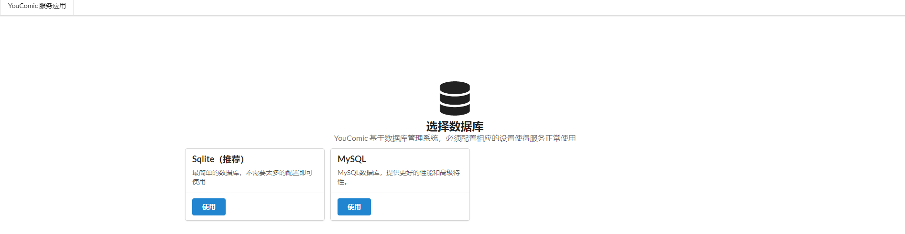
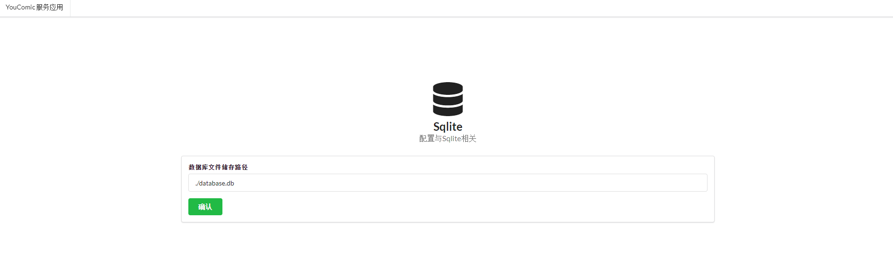
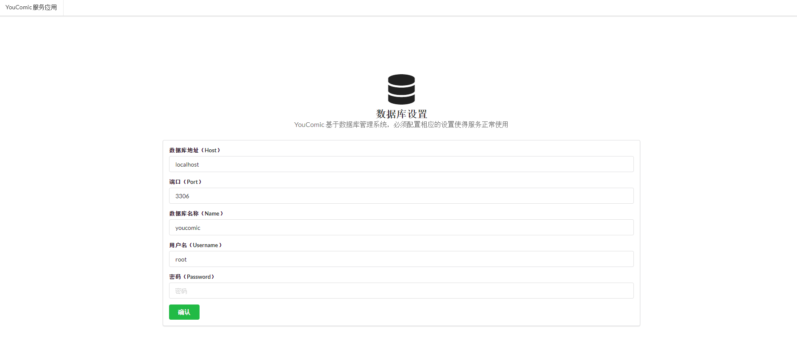
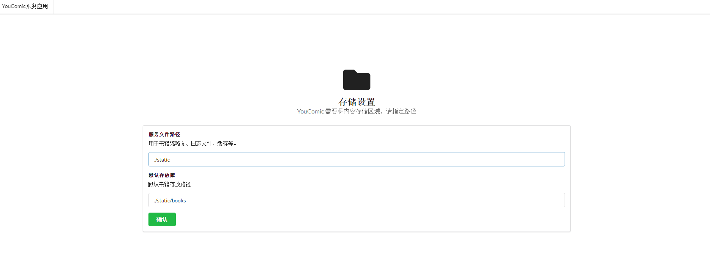
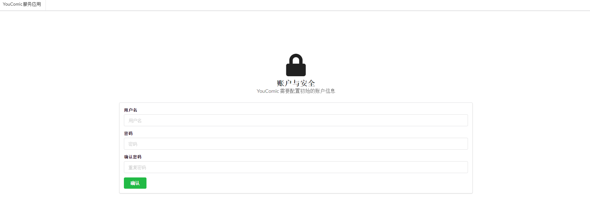
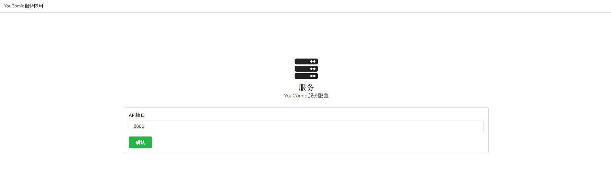

# 安装
首次启动YouComic的服务端会自动进入安装程序，地址为`http://localhost:8880`
大部分的安装配置不需要修改，只需要保持默认即可。

## 1.数据库

目前YouComic Server 支持SQLite与MySQL两种数据库，可以根据需要自行选择。

选择数据库之后会分别进入不同的数据库配置页面

### SQLite

### MySQL

## 2.存储
YouComic Server主要以文件管理为主，需要配置与存储相关的配置。

- 默认存放库  
默认存放库是默认Library的存放地址，YouComic正常工作需要一个默认的书库作为存放。服务程序支持多个库，可以在安装完成之后在Supervisor中添加。

- 服务文件路径  
服务在使用过程中需要产生例如：缩略图，日志文件等文件，需要指定一个存放路径使得服务正常使用。

## 3.账户
YouComic需要一个初始账户作为管理员账户，该账户的管理权限较大。

## 4.应用

配置相应的服务端口，通常情况下保持默认`8880端口`即可

## 5.完成

完成所有配置后，页面会指示用户重启服务，只需要重新打开应用程序即可(docker重启Container)